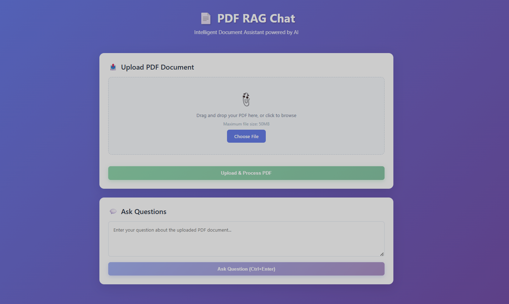
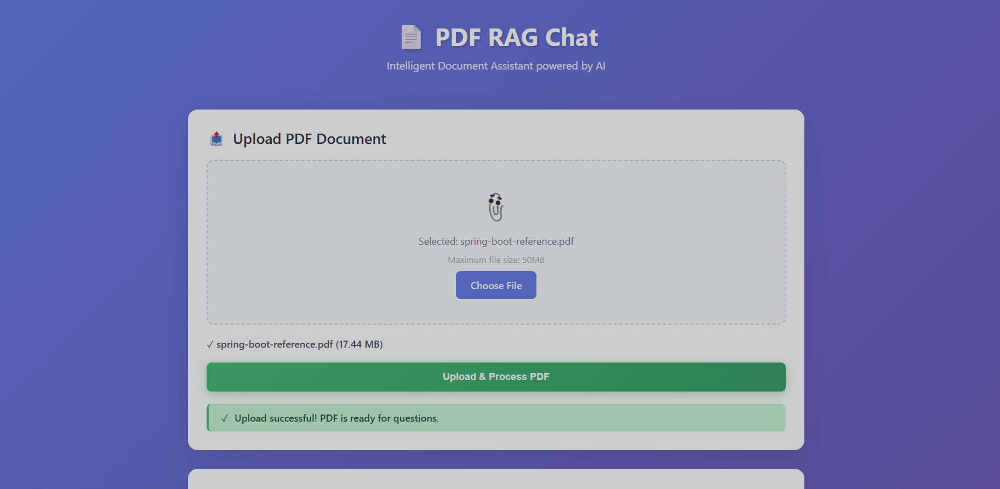
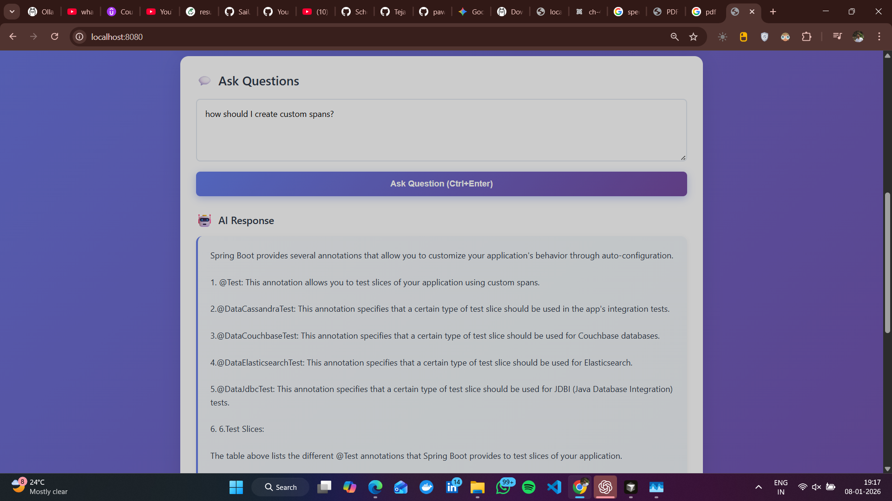

# Spring AI RAG PDF Chat Application

A full-stack Retrieval-Augmented Generation (RAG) application built with **Spring Boot** and **Spring AI** that allows users to **upload PDF documents via a web UI** and ask natural language questions against their content.  
The system dynamically ingests uploaded PDFs into a **PGVector-backed vector store** and uses a **locally running Ollama LLM** to generate context-aware answers.

---

## Features

- 📄 Upload PDFs (up to 50 MB) via web UI
- 💬 Ask natural language questions against uploaded documents
- 🧠 Retrieval-Augmented Generation (RAG) using Spring AI
- 🧩 Vector storage with PostgreSQL + PGVector
- 🏠 Local LLM inference using Ollama
- 🔁 On-demand document ingestion (no startup-only ingestion)

---

## Architecture Diagrams


### RAG Flow


### System Architecture


---

## Tech Stack

### Backend
- Java 21
- Spring Boot 3.4.x
- Spring AI (RAG)
- PostgreSQL + PGVector
- Apache Tika (PDF parsing)

### Frontend
- React (minimal UI for upload + chat)

### LLM
- Ollama (local inference)
- Default model: `qwen2:0.5b`

---

## Prerequisites

- Java 21
- Maven
- Docker & Docker Compose
- Ollama installed locally

---

## Setup Instructions

### 1. Install and run Ollama
Install Ollama from:
```

[https://ollama.com](https://ollama.com)

````

Verify it is running:
```bash
curl http://localhost:11434/api/tags
````

Pull the required model:

```bash
ollama pull qwen2:0.5b
```

---

### 2. Start PostgreSQL with PGVector

```bash
docker compose up -d
```

Postgres will be available on port `5432`.

---

### 3. Configure application

Update `application.properties` if needed:

```properties
spring.ai.ollama.base-url=http://localhost:11434
spring.ai.ollama.chat.model=qwen2:0.5b
spring.ai.ollama.embedding.model=qwen2:0.5b
spring.ai.ollama.init.pull-model-strategy=never
```

---

### 4. Run the backend

```bash
./mvnw spring-boot:run
```

The API will start on:

```
http://localhost:8080
```

---

### 5. Run the UI

Navigate to the UI folder and start the frontend (example):

```bash
npm install
npm start
```

---

## Usage

1. Open the web UI
2. Upload a PDF document
3. Ask questions related to the uploaded document
4. Receive answers generated using RAG over your document content

---

## API Endpoints

### Upload PDF

```
POST /api/upload
Content-Type: multipart/form-data
```

### Ask Question

```
POST /api/chat
Content-Type: text/plain
```

---

## Important Notes

* This project uses **local LLM inference** via Ollama
* It is **not serverless** and **not deployed on Vercel**
* Designed for **local execution, demos, and learning**
* Uploaded PDFs and vector data are **not committed to GitHub**

---

## Screenshots

### Upload UI


### Question UI


### Answer UI


---

## License

This project is intended for educational and learning purposes.


